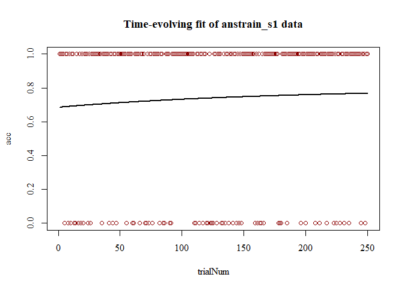

<!-- README.md is generated from README.Rmd. Please edit that file -->
Overview to Time-Evolving fits
------------------------------

The **TEfits** package streamlines nonlinear regression, such as that encountered in analysis of learning. The **TEfits** package is intended to assist in the implementation and interpretation of nonlinear regression with a heavy emphasis on interpretability of parameters. Parameters fit by **TEfits** are meant to reflect human-interpretable representations of time-evolving processes. Error functions, nonlinear ("change") functions linking parameters and time to predicted values, parameter and prediction boundaries, and goodness-of-fit indices are intended to be clear and adjustable. An equal emphasis is on ease of use: minimal arguments are necessary to begin using the primary function, `TEfit()`, and many common tasks are fully automated (e.g., optimization starting points, bootstrapping).

``` r
mod <- TEfit(anstrain_s1[,c('acc','trialNum')])
```

    ## 
    ## Your rate is very close to the boundary. Consider penalizing the likelihood.

``` r
plot(mod,plot_title='Time-evolving fit of anstrain_s1 data')
```



``` r
summary(mod)
```

    ## 
    ## >> Call: acc~(pAsym) + ((pStart) - (pAsym)) * 2^((1 - trialNum)/(2^(pRate)))
    ## 
    ## >> Converged: TRUE 
    ## 
    ## >> Fit Values:
    ##        Estimate
    ## pAsym     0.795
    ## pStart    0.686
    ## pRate     6.960
    ## 
    ## >> Goodness-of-fit:
    ##          err nullErr nPars nObs      Fval      Pval    Rsquared      BIC
    ## ols 48.43851  48.576     3  250 0.3505375 0.7046592 0.002830327 -393.727
    ##       nullBIC deltaBIC
    ## ols -404.0614 10.33434
    ## 
    ## >> Test of change in nonindependence:
    ##                                           rawSpearman modelConditionalSpearman
    ## Nonindependence between acc and trialNum:  0.06085813                0.5674394
    ##                                           proportionalSpearmanChange
    ## Nonindependence between acc and trialNum:                    9.32397
    ##                                           pValSpearmanChange
    ## Nonindependence between acc and trialNum:       9.372569e-11
