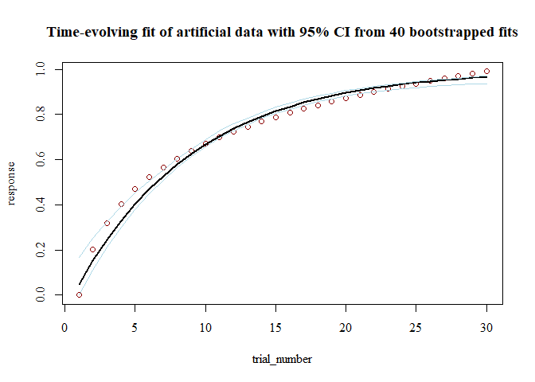

<!-- README.md is generated from README.Rmd. Please edit that file -->
Overview to Time-Evolving fits
------------------------------

Data is described, interpreted, and tested using indices such as d prime, mean, or psychometric function threshold. The **TEfits** package serves to allow the same questions to be asked about time-evolving aspects of these indices, such as the starting level, the amount of time that the index takes to change, and the asymptotic level of that index. Nonlinear regression applied to time-evolving functions is made as intuitive and painless as is feasible, with many extensions if desired.

The **TEfits** package has a heavy emphasis on interpretability of parameters. As far as possible, parameters fit by **TEfits** are meant to reflect human-interpretable representations of time-evolving processes. Error functions, nonlinear ("change") functions linking predicted values to parameters and time, parameter and prediction boundaries, and goodness-of-fit indices are intended to be clear and adjustable. An equal emphasis is on ease of use: minimal arguments are necessary to begin using the primary function, `TEfit()`, and many common tasks are fully automated (e.g., optimization starting points, bootstrapping).

``` r
dat <- data.frame(response=log(1:30),trial_number=1:30)
mod <- TEfit(dat[,c('response','trial_number')])

plot(mod,plot_title='Time-evolving fit of artificial data')
```


``` r
summary(mod)
```

    ## 
    ## >> Call: response~(pAsym) + ((pStart) - (pAsym)) * 2^((1 - trial_number)/(2^(pRate)))
    ## 
    ## >> Converged: TRUE 
    ## 
    ## >> Fit Values:
    ##        Estimate
    ## pAsym     3.371
    ## pStart    0.316
    ## pRate     2.543
    ## 
    ## >> Goodness-of-fit:
    ##           err nullErr nPars nObs     Fval Pval  Rsquared       BIC   nullBIC
    ## ols 0.2760858  20.974     3   30 1012.083    0 0.9868368 -130.4436 -7.336215
    ##      deltaBIC
    ## ols -123.1074
    ## 
    ## >> Test of change in nonindependence:
    ##                                                    rawSpearman
    ## Nonindependence between response and trial_number:           1
    ##                                                    modelConditionalSpearman
    ## Nonindependence between response and trial_number:             0.0002224694
    ##                                                    proportionalSpearmanChange
    ## Nonindependence between response and trial_number:               0.0002224694
    ##                                                    pValSpearmanChange
    ## Nonindependence between response and trial_number:                  0

An example of a learning fit using a Bernoulli response distribution, with 40 bootstrapped fits.

``` r
dat <- data.frame(response=log(1:30)/log(31),trial_number=1:30)
mod <- TEfit(dat[,c('response','trial_number')], 
             errFun='bernoulli',
             bootPars=list(nBoots=40))
plot(mod,plot_title='Time-evolving fit of artificial data with 95% CI from 40 bootstrapped fits')
```



``` r
summary(mod)
```

    ## 
    ## >> Call: response~(pAsym) + ((pStart) - (pAsym)) * 2^((1 - trial_number)/(2^(pRate)))
    ## 
    ## >> Converged: TRUE 
    ## 
    ## >> Fit Values:
    ##        Estimate  Q025  Q975 pseudoSE
    ## pAsym     0.998 0.955 1.000    0.011
    ## pRate     2.557 2.285 2.743    0.117
    ## pStart    0.046 0.000 0.168    0.043
    ## 
    ## >> Goodness-of-fit:
    ##                err nullErr nPars nObs      BIC nullBIC  deltaBIC
    ## bernoulli 13.11101 17.6538     3   30 36.42561 38.7088 -2.283196
    ## 
    ## >> Test of change in nonindependence:
    ##                                                    rawSpearman
    ## Nonindependence between response and trial_number:           1
    ##                                                    modelConditionalSpearman
    ## Nonindependence between response and trial_number:                0.2520578
    ##                                                    proportionalSpearmanChange
    ## Nonindependence between response and trial_number:                  0.2520578
    ##                                                    pValSpearmanChange
    ## Nonindependence between response and trial_number:                  0
    ## 
    ## >> Percent of resamples predicting an increase in values: 100 
    ## 
    ## >> Timepoint at which resampled estimates diverge from timepoint 1, with Cohen's d>1: 2 
    ## 
    ## >> Bootstrapped parameter correlations:
    ##         pAsym pStart pRate    err
    ## pAsym   1.000  0.485 0.823 -0.270
    ## pStart  0.485  1.000 0.864  0.422
    ## pRate   0.823  0.864 1.000  0.127
    ## err    -0.270  0.422 0.127  1.000
