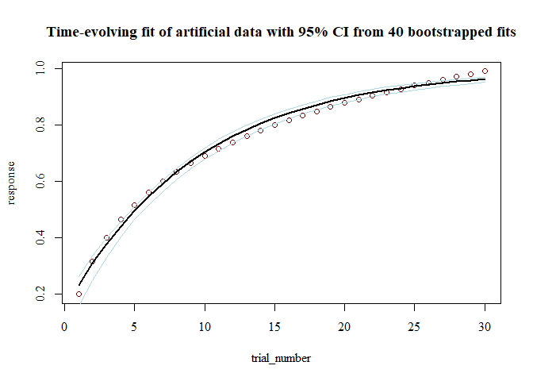

<!-- README.md is generated from README.Rmd. Please edit that file -->
Overview to Time-Evolving fits
------------------------------

Data is described, interpreted, and tested using indices such as d prime, mean, or psychometric function threshold. The **TEfits** package serves to allow the same questions to be asked about time-evolving aspects of these indices, such as the starting level, the amount of time that the index takes to change, and the asymptotic level of that index. Nonlinear regression applied to time-evolving functions is made as intuitive and painless as is feasible, with many extensions if desired.

The **TEfits** package has a heavy emphasis on interpretability of parameters. As far as possible, parameters fit by **TEfits** are meant to reflect human-interpretable representations of time-evolving processes. Error functions, nonlinear ("change") functions linking predicted values to parameters and time, parameter and prediction boundaries, and goodness-of-fit indices are intended to be clear and adjustable. An equal emphasis is on ease of use: minimal arguments are necessary to begin using the primary function, `TEfit()`, and many common tasks are fully automated (e.g., optimization starting points, bootstrapping).

``` r
dat <- data.frame(response=log(2:31),trial_number=1:30)
mod <- TEfit(dat[,c('response','trial_number')])

plot(mod,plot_title='Time-evolving fit of artificial data')
```


``` r
summary(mod)
```

    ## 
    ## >> Call: response~(pAsym) + ((pStart) - (pAsym)) * 2^((1 - trial_number)/(2^(pRate)))
    ## 
    ## >> Converged: TRUE 
    ## 
    ## >> Fit Values:
    ##        Estimate
    ## pAsym     3.522
    ## pStart    0.869
    ## pRate     2.867
    ## 
    ## >> Goodness-of-fit:
    ##            err nullErr nPars nObs     Fval Pval  Rsquared       BIC   nullBIC
    ## ols 0.09355704 15.2815     3   30 2191.574    0 0.9938778 -162.9078 -16.83544
    ##      deltaBIC
    ## ols -146.0724
    ## 
    ## >> Test of change in nonindependence:
    ##                                                    rawSpearman
    ## Nonindependence between response and trial_number:           1
    ##                                                    modelConditionalSpearman
    ## Nonindependence between response and trial_number:               0.03537264
    ##                                                    proportionalSpearmanChange
    ## Nonindependence between response and trial_number:                 0.03537264
    ##                                                    pValSpearmanChange
    ## Nonindependence between response and trial_number:                  0

An example of a learning fit using a Bernoulli response distribution, with 40 bootstrapped fits.

``` r
dat <- data.frame(response=log(2:31)/log(32),trial_number=1:30)
mod <- TEfit(dat[,c('response','trial_number')], 
             errFun='bernoulli',
             bootPars=list(nBoots=40))
plot(mod,plot_title='Time-evolving fit of artificial data with 95% CI from 40 bootstrapped fits')
```



``` r
summary(mod)
```

    ## 
    ## >> Call: response~(pAsym) + ((pStart) - (pAsym)) * 2^((1 - trial_number)/(2^(pRate)))
    ## 
    ## >> Converged: TRUE 
    ## 
    ## >> Fit Values:
    ##        Estimate  Q025  Q975 pseudoSE
    ## pAsym     1.000 1.000 1.000    0.000
    ## pRate     2.739 2.684 2.832    0.038
    ## pStart    0.231 0.209 0.260    0.013
    ## 
    ## >> Goodness-of-fit:
    ##                err  nullErr nPars nObs      BIC  nullBIC    deltaBIC
    ## bernoulli 13.42284 16.83409     3   30 37.04928 37.06937 -0.02009108
    ## 
    ## >> Test of change in nonindependence:
    ##                                                    rawSpearman
    ## Nonindependence between response and trial_number:           1
    ##                                                    modelConditionalSpearman
    ## Nonindependence between response and trial_number:              -0.03581758
    ##                                                    proportionalSpearmanChange
    ## Nonindependence between response and trial_number:                 0.03581758
    ##                                                    pValSpearmanChange
    ## Nonindependence between response and trial_number:                  0
    ## 
    ## >> Percent of resamples predicting an increase in values: 100 
    ## 
    ## >> Timepoint at which resampled estimates diverge from timepoint 1, with Cohen's d>1: 2 
    ## 
    ## >> Bootstrapped parameter correlations:
    ##         pAsym pStart  pRate    err
    ## pAsym   1.000 -0.176 -0.245 -0.077
    ## pStart -0.176  1.000  0.840  0.504
    ## pRate  -0.245  0.840  1.000  0.562
    ## err    -0.077  0.504  0.562  1.000

An example of fitting a given model to subsets of data (e.g., individual participants within a behavioral study).

``` r
dat <- data.frame(response=rep(dat$response,4)*seq(0,.2,length=120),trial_number=rep(1:30,4),group=rep(letters[1:4],each=30))

mod <- TEfitAll(dat[,c('response','trial_number')], 
             groupingVar = dat$group)
```

    ## 
    ## Your rate is very close to the boundary. Consider penalizing the likelihood.. 
    ## Your rate is very close to the boundary. Consider penalizing the likelihood.. 
    ## Your rate is very close to the boundary. Consider penalizing the likelihood.. .

``` r
plot(mod)
```


``` r
summary(mod)
```

    ## 
    ## >> Call: response ~ (pAsym) + ((pStart) - (pAsym)) * 2^((1 - trial_number)/(2^(pRate)))
    ## 
    ## >> Overall effects:
    ##             pAsym     pStart      pRate
    ## mean   0.14922125 0.01638942 3.83358311
    ## stdErr 0.03932946 0.01060345 0.02439782
    ## 
    ##                 err    nullErr nPars nObs      Fval         Pval   Rsquared
    ## mean   3.005043e-04 0.03071614     3   30 1692.5911 1.110223e-16 0.97598961
    ## stdErr 6.864637e-05 0.01187769     0    0  653.4833 1.110223e-16 0.01661145
    ##                BIC    nullBIC   deltaBIC  linkFun errFun changeFun converged
    ## mean   -337.338939 -211.91820 -125.42074 identity    ols      expo         1
    ## stdErr    6.548342   14.35328   19.26151 identity    ols      expo         0
    ##        pValSpearmanChange
    ## mean                    0
    ## stdErr                  0
    ## 
    ## 
    ## >> Max runs: 500  -- Tolerance: 0.05 
    ## 
    ## >> Parameter Pearson product-moment correlations:

    ##         pAsym pStart  pRate
    ## pAsym   1.000  1.000 -0.757
    ## pStart  1.000  1.000 -0.763
    ## pRate  -0.757 -0.763  1.000
