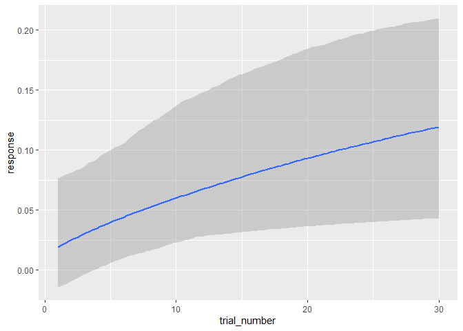

<!-- README.md is generated from README.Rmd. Please edit that file -->
TEfits
======

[](https://opensource.org/licenses/MIT) [](https://zenodo.org/badge/latestdoi/225967950) [](https://joss.theoj.org/papers/0d67da372696cc9a817255858d8bb8a7) [](https://travis-ci.com/akcochrane/TEfits)

Overview to Time-Evolving fits
------------------------------

Behavioral data is described, interpreted, and tested using indices such as d prime, mean, or psychometric function threshold. The **TEfits** package serves to allow the same questions to be asked about time-evolving aspects of these indices, such as the starting level, the amount of time that the index takes to change, and the asymptotic level of that index. Nonlinear regression applied to time-evolving functions is made as intuitive and painless as is feasible, with many extensions if desired.

The **TEfits** package has a heavy emphasis on interpretability of parameters. As far as possible, parameters fit by **TEfits** are meant to reflect human-interpretable representations of time-evolving processes. Error functions, nonlinear ("change") functions linking predicted values to parameters and time, parameter and prediction boundaries, and goodness-of-fit indices are intended to be clear and adjustable. An equal emphasis is on ease of use: minimal arguments are necessary to begin using the primary function, `TEfit()`, and many common tasks are fully automated (e.g., optimization starting points, bootstrapping).

Installing the package
----------------------

The R package `devtools` includes a very easy way to install packages from Github.

    devtools::install_github('akcochrane/TEfits', build_vignettes = TRUE)

Although having vignettes is nice for exploring the functionality of the package (via `browseVignettes('TEfits')`), building the vignettes takes a minute or two. Remove the `build_vignettes = TRUE` argument to speed up installation.

Simple model of exponential change
----------------------------------

A basic maximum-likelihood model nonlinearly relating time to an outcome variable. The first argument is a data frame, with the first column being the response variable and the second column being the time variable.

``` r
library(TEfits)

# generate artificial data:
dat <- data.frame(response=log(2:31)/log(32),trial_number=1:30)

# fit a `TEfit` model
mod_simple <- TEfit(dat[,c('response','trial_number')])

plot(mod_simple,plot_title='Time-evolving fit of artificial data')
```


``` r
summary(mod_simple)
```

    ## 
    ## >> Formula: response~((pAsym) + ((pStart) - (pAsym)) * 2^((1 - trial_number)/(2^(pRate))))
    ## 
    ## >> Converged: TRUE 
    ## 
    ## >> Fit Values:
    ##        Estimate
    ## pAsym     1.016
    ## pStart    0.251
    ## pRate     2.866
    ## 
    ## >> Goodness-of-fit:
    ##             err  nullErr nPars nObs     Fval Pval  Rsquared       BIC   nullBIC
    ## ols 0.007789065 1.272257     3   30 2191.575    0 0.9938778 -237.4834 -91.41094
    ##      deltaBIC
    ## ols -146.0724
    ## 
    ## >> Test of change in nonindependence:
    ##                          rawSpearman modelConditionalSpearman
    ## response ~ trial_number:          -1               0.03537264
    ##                          proportionalSpearmanChange pValSpearmanChange
    ## response ~ trial_number:                 0.03537264                  0

Alternatively, a similar model can be fit using the Bayesian package `brms`. This takes a bit longer, but provides more information about the model.

`mod_TEbrm <- TEbrm(response ~ trial_number, dat)`

    ## 
    ## SAMPLING FOR MODEL '24fb7a14b096f1389976e4d28e0094dc' NOW (CHAIN 1).
    ## Chain 1: 
    ## Chain 1: Gradient evaluation took 0 seconds
    ## Chain 1: 1000 transitions using 10 leapfrog steps per transition would take 0 seconds.
    ## Chain 1: Adjust your expectations accordingly!
    ## Chain 1: 
    ## Chain 1: 
    ## Chain 1: Iteration:   1 / 1000 [  0%]  (Warmup)
    ## Chain 1: Iteration: 100 / 1000 [ 10%]  (Warmup)
    ## Chain 1: Iteration: 200 / 1000 [ 20%]  (Warmup)
    ## Chain 1: Iteration: 300 / 1000 [ 30%]  (Warmup)
    ## Chain 1: Iteration: 400 / 1000 [ 40%]  (Warmup)
    ## Chain 1: Iteration: 500 / 1000 [ 50%]  (Warmup)
    ## Chain 1: Iteration: 501 / 1000 [ 50%]  (Sampling)
    ## Chain 1: Iteration: 600 / 1000 [ 60%]  (Sampling)
    ## Chain 1: Iteration: 700 / 1000 [ 70%]  (Sampling)
    ## Chain 1: Iteration: 800 / 1000 [ 80%]  (Sampling)
    ## Chain 1: Iteration: 900 / 1000 [ 90%]  (Sampling)
    ## Chain 1: Iteration: 1000 / 1000 [100%]  (Sampling)
    ## Chain 1: 
    ## Chain 1:  Elapsed Time: 0.256 seconds (Warm-up)
    ## Chain 1:                0.212 seconds (Sampling)
    ## Chain 1:                0.468 seconds (Total)
    ## Chain 1: 
    ## 
    ## SAMPLING FOR MODEL '24fb7a14b096f1389976e4d28e0094dc' NOW (CHAIN 2).
    ## Chain 2: 
    ## Chain 2: Gradient evaluation took 0 seconds
    ## Chain 2: 1000 transitions using 10 leapfrog steps per transition would take 0 seconds.
    ## Chain 2: Adjust your expectations accordingly!
    ## Chain 2: 
    ## Chain 2: 
    ## Chain 2: Iteration:   1 / 1000 [  0%]  (Warmup)
    ## Chain 2: Iteration: 100 / 1000 [ 10%]  (Warmup)
    ## Chain 2: Iteration: 200 / 1000 [ 20%]  (Warmup)
    ## Chain 2: Iteration: 300 / 1000 [ 30%]  (Warmup)
    ## Chain 2: Iteration: 400 / 1000 [ 40%]  (Warmup)
    ## Chain 2: Iteration: 500 / 1000 [ 50%]  (Warmup)
    ## Chain 2: Iteration: 501 / 1000 [ 50%]  (Sampling)
    ## Chain 2: Iteration: 600 / 1000 [ 60%]  (Sampling)
    ## Chain 2: Iteration: 700 / 1000 [ 70%]  (Sampling)
    ## Chain 2: Iteration: 800 / 1000 [ 80%]  (Sampling)
    ## Chain 2: Iteration: 900 / 1000 [ 90%]  (Sampling)
    ## Chain 2: Iteration: 1000 / 1000 [100%]  (Sampling)
    ## Chain 2: 
    ## Chain 2:  Elapsed Time: 0.251 seconds (Warm-up)
    ## Chain 2:                0.197 seconds (Sampling)
    ## Chain 2:                0.448 seconds (Total)
    ## Chain 2: 
    ## 
    ## SAMPLING FOR MODEL '24fb7a14b096f1389976e4d28e0094dc' NOW (CHAIN 3).
    ## Chain 3: 
    ## Chain 3: Gradient evaluation took 0 seconds
    ## Chain 3: 1000 transitions using 10 leapfrog steps per transition would take 0 seconds.
    ## Chain 3: Adjust your expectations accordingly!
    ## Chain 3: 
    ## Chain 3: 
    ## Chain 3: Iteration:   1 / 1000 [  0%]  (Warmup)
    ## Chain 3: Iteration: 100 / 1000 [ 10%]  (Warmup)
    ## Chain 3: Iteration: 200 / 1000 [ 20%]  (Warmup)
    ## Chain 3: Iteration: 300 / 1000 [ 30%]  (Warmup)
    ## Chain 3: Iteration: 400 / 1000 [ 40%]  (Warmup)
    ## Chain 3: Iteration: 500 / 1000 [ 50%]  (Warmup)
    ## Chain 3: Iteration: 501 / 1000 [ 50%]  (Sampling)
    ## Chain 3: Iteration: 600 / 1000 [ 60%]  (Sampling)
    ## Chain 3: Iteration: 700 / 1000 [ 70%]  (Sampling)
    ## Chain 3: Iteration: 800 / 1000 [ 80%]  (Sampling)
    ## Chain 3: Iteration: 900 / 1000 [ 90%]  (Sampling)
    ## Chain 3: Iteration: 1000 / 1000 [100%]  (Sampling)
    ## Chain 3: 
    ## Chain 3:  Elapsed Time: 0.255 seconds (Warm-up)
    ## Chain 3:                0.213 seconds (Sampling)
    ## Chain 3:                0.468 seconds (Total)
    ## Chain 3:


    ##  Family: gaussian 
    ##   Links: mu = identity; sigma = identity 
    ## Formula: response ~ pAsym + ((pStart) - (pAsym)) * 2^((1 - trial_number)/(2^(pRate))) 
    ##          pStart ~ 1
    ##          pRate ~ 1
    ##          pAsym ~ 1
    ##    Data: attr(rhs_form, "data") (Number of observations: 30) 
    ## Samples: 3 chains, each with iter = 1000; warmup = 500; thin = 1;
    ##          total post-warmup samples = 1500
    ## 
    ## Population-Level Effects: 
    ##                  Estimate Est.Error l-95% CI u-95% CI Rhat Bulk_ESS Tail_ESS
    ## pStart_Intercept     0.25      0.01     0.23     0.28 1.00      562      565
    ## pRate_Intercept      2.88      0.09     2.72     3.06 1.00      397      345
    ## pAsym_Intercept      1.02      0.02     0.99     1.05 1.00      448      369
    ## 
    ## Family Specific Parameters: 
    ##       Estimate Est.Error l-95% CI u-95% CI Rhat Bulk_ESS Tail_ESS
    ## sigma     0.02      0.00     0.01     0.02 1.01      587      708
    ## 
    ## Samples were drawn using sampling(NUTS). For each parameter, Bulk_ESS
    ## and Tail_ESS are effective sample size measures, and Rhat is the potential
    ## scale reduction factor on split chains (at convergence, Rhat = 1).

Bootstrapped model with Bernoulli error function
------------------------------------------------

An example of a maximum-likelihood fit using a Bernoulli response distribution, with 40 bootstrapped fits.

``` r
# fit a `TEfit` model
mod_boot <- TEfit(dat[,c('response','trial_number')], 
             errFun='bernoulli',
             bootPars=tef_bootList(resamples = 40))
plot(mod_boot,plot_title='Time-evolving fit of artificial data with 95% CI from 40 bootstrapped fits')
```


``` r
summary(mod_boot)
```

    ## 
    ## >> Formula: response~((pAsym) + ((pStart) - (pAsym)) * 2^((1 - trial_number)/(2^(pRate))))
    ## 
    ## >> Converged: TRUE 
    ## 
    ## >> Fit Values:
    ##        Estimate  Q025  Q975 pseudoSE
    ## pAsym     0.999 0.987 1.000    0.003
    ## pRate     2.716 2.538 2.802    0.067
    ## pStart    0.237 0.179 0.291    0.029
    ## 
    ## >> Goodness-of-fit:
    ##                err  nullErr nPars nObs      BIC  nullBIC    deltaBIC
    ## bernoulli 13.42573 16.83409     3   30 37.05505 37.06937 -0.01432375
    ## 
    ## >> Test of change in nonindependence:
    ##                          rawSpearman modelConditionalSpearman
    ## response ~ trial_number:          -1                -0.127475
    ##                          proportionalSpearmanChange pValSpearmanChange
    ## response ~ trial_number:                   0.127475                  0
    ## 
    ## >> Percent of resamples predicting an increase in values: 100 
    ## 
    ## >> Timepoint at which resampled estimates diverge from timepoint 1, with Cohen's d>1: 2 
    ## 
    ## >> Bootstrapped parameter correlations:
    ##         pAsym pStart pRate    err
    ## pAsym   1.000 -0.092 0.277 -0.028
    ## pStart -0.092  1.000 0.658  0.308
    ## pRate   0.277  0.658 1.000  0.153
    ## err    -0.028  0.308 0.153  1.000

Fitting multiple models
-----------------------

An example of fitting a given model to subsets of data (e.g., individual participants within a behavioral study).

``` r
# generate artificial data:
dat <- data.frame(response=rep(dat$response,4)*seq(0,.2,length=120),trial_number=rep(1:30,4),group=rep(letters[1:4],each=30))

# fit a `TEfitAll` model
mod_4group <- TEfitAll(dat[,c('response','trial_number')], 
             groupingVar = dat$group,
             groupingVarName = 'Participant')
```

    ## 
    ## Your rate is very close to the boundary. Consider penalizing the likelihood.. 
    ## Your rate is very close to the boundary. Consider penalizing the likelihood.. 
    ## Your rate is very close to the boundary. Consider penalizing the likelihood.. .

Note the warnings regarding rate parameters; identifiability is a major concern in nonlinear models, and `TEfits` attempts to notify the user of potentially problematic situations.

``` r
plot(mod_4group)
```


``` r
summary(mod_4group)
```

    ## 
    ## >> Formula: response ~ ((pAsym) + ((pStart) - (pAsym)) * 2^((1 - trial_number)/(2^(pRate))))
    ## 
    ## >> Overall effects:
    ##             pAsym     pStart      pRate
    ## mean   0.14922721 0.01639028 3.83366521
    ## stdErr 0.03933404 0.01060450 0.02431579
    ## 
    ##                 err    nullErr nPars nObs      Fval         Pval   Rsquared
    ## mean   3.005041e-04 0.03071614     3   30 1692.5939 1.110223e-16 0.97598962
    ## stdErr 6.864644e-05 0.01187769     0    0  653.4848 1.110223e-16 0.01661145
    ##                BIC    nullBIC   deltaBIC  linkFun errFun changeFun converged
    ## mean   -337.338970 -211.91820 -125.42077 identity    ols      expo         1
    ## stdErr    6.548355   14.35328   19.26152 identity    ols      expo         0
    ##        pValSpearmanChange
    ## mean                    0
    ## stdErr                  0
    ## 
    ## 
    ## >> Max runs: 200  -- Tolerance: 0.05 
    ## 
    ## >> Parameter Pearson product-moment correlations:

    ##         pAsym pStart  pRate
    ## pAsym   1.000  1.000 -0.757
    ## pStart  1.000  1.000 -0.763
    ## pRate  -0.757 -0.763  1.000

An analogous model, this time fitting "participant-level" models as random effects within a mixed-effects model, can be implemented using `TEbrm`.

`mod_4group_TEbrm <- TEbrm(response ~` `tef_change_expo3('trial_number',parForm = ~ (1|group))` `,dataIn = dat)`

    ## 
    ## SAMPLING FOR MODEL 'ec7a53ce60e88c9f52bc73902e26264a' NOW (CHAIN 1).
    ## Chain 1: 
    ## Chain 1: Gradient evaluation took 0 seconds
    ## Chain 1: 1000 transitions using 10 leapfrog steps per transition would take 0 seconds.
    ## Chain 1: Adjust your expectations accordingly!
    ## Chain 1: 
    ## Chain 1: 
    ## Chain 1: Iteration:   1 / 1000 [  0%]  (Warmup)
    ## Chain 1: Iteration: 100 / 1000 [ 10%]  (Warmup)
    ## Chain 1: Iteration: 200 / 1000 [ 20%]  (Warmup)
    ## Chain 1: Iteration: 300 / 1000 [ 30%]  (Warmup)
    ## Chain 1: Iteration: 400 / 1000 [ 40%]  (Warmup)
    ## Chain 1: Iteration: 500 / 1000 [ 50%]  (Warmup)
    ## Chain 1: Iteration: 501 / 1000 [ 50%]  (Sampling)
    ## Chain 1: Iteration: 600 / 1000 [ 60%]  (Sampling)
    ## Chain 1: Iteration: 700 / 1000 [ 70%]  (Sampling)
    ## Chain 1: Iteration: 800 / 1000 [ 80%]  (Sampling)
    ## Chain 1: Iteration: 900 / 1000 [ 90%]  (Sampling)
    ## Chain 1: Iteration: 1000 / 1000 [100%]  (Sampling)
    ## Chain 1: 
    ## Chain 1:  Elapsed Time: 34.169 seconds (Warm-up)
    ## Chain 1:                41.87 seconds (Sampling)
    ## Chain 1:                76.039 seconds (Total)
    ## Chain 1: 
    ## 
    ## SAMPLING FOR MODEL 'ec7a53ce60e88c9f52bc73902e26264a' NOW (CHAIN 2).
    ## Chain 2: 
    ## Chain 2: Gradient evaluation took 0.001 seconds
    ## Chain 2: 1000 transitions using 10 leapfrog steps per transition would take 10 seconds.
    ## Chain 2: Adjust your expectations accordingly!
    ## Chain 2: 
    ## Chain 2: 
    ## Chain 2: Iteration:   1 / 1000 [  0%]  (Warmup)
    ## Chain 2: Iteration: 100 / 1000 [ 10%]  (Warmup)
    ## Chain 2: Iteration: 200 / 1000 [ 20%]  (Warmup)
    ## Chain 2: Iteration: 300 / 1000 [ 30%]  (Warmup)
    ## Chain 2: Iteration: 400 / 1000 [ 40%]  (Warmup)
    ## Chain 2: Iteration: 500 / 1000 [ 50%]  (Warmup)
    ## Chain 2: Iteration: 501 / 1000 [ 50%]  (Sampling)
    ## Chain 2: Iteration: 600 / 1000 [ 60%]  (Sampling)
    ## Chain 2: Iteration: 700 / 1000 [ 70%]  (Sampling)
    ## Chain 2: Iteration: 800 / 1000 [ 80%]  (Sampling)
    ## Chain 2: Iteration: 900 / 1000 [ 90%]  (Sampling)
    ## Chain 2: Iteration: 1000 / 1000 [100%]  (Sampling)
    ## Chain 2: 
    ## Chain 2:  Elapsed Time: 34.695 seconds (Warm-up)
    ## Chain 2:                42.055 seconds (Sampling)
    ## Chain 2:                76.75 seconds (Total)
    ## Chain 2: 
    ## 
    ## SAMPLING FOR MODEL 'ec7a53ce60e88c9f52bc73902e26264a' NOW (CHAIN 3).
    ## Chain 3: 
    ## Chain 3: Gradient evaluation took 0.001 seconds
    ## Chain 3: 1000 transitions using 10 leapfrog steps per transition would take 10 seconds.
    ## Chain 3: Adjust your expectations accordingly!
    ## Chain 3: 
    ## Chain 3: 
    ## Chain 3: Iteration:   1 / 1000 [  0%]  (Warmup)
    ## Chain 3: Iteration: 100 / 1000 [ 10%]  (Warmup)
    ## Chain 3: Iteration: 200 / 1000 [ 20%]  (Warmup)
    ## Chain 3: Iteration: 300 / 1000 [ 30%]  (Warmup)
    ## Chain 3: Iteration: 400 / 1000 [ 40%]  (Warmup)
    ## Chain 3: Iteration: 500 / 1000 [ 50%]  (Warmup)
    ## Chain 3: Iteration: 501 / 1000 [ 50%]  (Sampling)
    ## Chain 3: Iteration: 600 / 1000 [ 60%]  (Sampling)
    ## Chain 3: Iteration: 700 / 1000 [ 70%]  (Sampling)
    ## Chain 3: Iteration: 800 / 1000 [ 80%]  (Sampling)
    ## Chain 3: Iteration: 900 / 1000 [ 90%]  (Sampling)
    ## Chain 3: Iteration: 1000 / 1000 [100%]  (Sampling)
    ## Chain 3: 
    ## Chain 3:  Elapsed Time: 33.687 seconds (Warm-up)
    ## Chain 3:                40.23 seconds (Sampling)
    ## Chain 3:                73.917 seconds (Total)
    ## Chain 3:

``` r
conditional_effects(mod_4group_TEbrm)
```



``` r
summary(mod_4group_TEbrm)
```

    ##  Family: gaussian 
    ##   Links: mu = identity; sigma = identity 
    ## Formula: response ~ pAsym + ((pStart) - (pAsym)) * 2^((1 - trial_number)/(2^(pRate))) 
    ##          pStart ~ (1 | group)
    ##          pRate ~ (1 | group)
    ##          pAsym ~ (1 | group)
    ##    Data: attr(rhs_form, "data") (Number of observations: 120) 
    ## Samples: 3 chains, each with iter = 1000; warmup = 500; thin = 1;
    ##          total post-warmup samples = 1500
    ## 
    ## Group-Level Effects: 
    ## ~group (Number of levels: 4) 
    ##                      Estimate Est.Error l-95% CI u-95% CI Rhat Bulk_ESS
    ## sd(pStart_Intercept)     0.04      0.03     0.01     0.12 1.00      471
    ## sd(pRate_Intercept)      1.71      0.80     0.73     3.69 1.00      508
    ## sd(pAsym_Intercept)      0.07      0.08     0.01     0.31 1.00      529
    ##                      Tail_ESS
    ## sd(pStart_Intercept)      733
    ## sd(pRate_Intercept)       549
    ## sd(pAsym_Intercept)       560
    ## 
    ## Population-Level Effects: 
    ##                  Estimate Est.Error l-95% CI u-95% CI Rhat Bulk_ESS Tail_ESS
    ## pStart_Intercept     0.02      0.02    -0.01     0.07 1.01      440      554
    ## pRate_Intercept      4.63      0.66     3.16     5.72 1.00      403      399
    ## pAsym_Intercept      0.22      0.04     0.12     0.30 1.00      618      360
    ## 
    ## Family Specific Parameters: 
    ##       Estimate Est.Error l-95% CI u-95% CI Rhat Bulk_ESS Tail_ESS
    ## sigma     0.00      0.00     0.00     0.00 1.00     1366      926
    ## 
    ## Samples were drawn using sampling(NUTS). For each parameter, Bulk_ESS
    ## and Tail_ESS are effective sample size measures, and Rhat is the potential
    ## scale reduction factor on split chains (at convergence, Rhat = 1).

Using a more common linear regression framework
-----------------------------------------------

In some cases (such as `mod_simple` above), similar performance can be attained using a nonlinear transformation of time as a predictor in a linear model. This method is plotted in green on top of the `mod_simple` results, with clearly near-identical fits.

``` r
# Fit a `lm` model, first computing the best nonlinear transformation for time:
mod_lm <- TElm(response~trial_number,dat,timeVar = 'trial_number')

plot(mod_simple)

lines(dat$trial_number,fitted(mod_lm),col='green',lty=2,lwd=2)
```


TElm parameter estimates:

|  X.Intercept.|  trial\_number|   rate|
|-------------:|--------------:|------:|
|          0.13|         -0.118|  3.355|

TEfit parameter estimates:

|          |  pAsym|  pStart|  pRate|
|:---------|------:|-------:|------:|
| Estimate |  1.016|   0.251|  2.866|

Note that `TEfit` provides start and asymptote parameters directly, while `TElm` provides start as an offset from asymptote (ie., `Intercept`).

For extensions of this framework see `TEglm`, `TElmem`, and `TEglmem`.

Testing functionality
=====================

`TEfits` includes automatic testing using the `testthat` package and [Travis-CI](https://travis-ci.com/github/akcochrane/TEfits). If users wish to run these tests locally, it's recommended to download/clone the repo to a local directory `~/TEfits`. Then install and run tests as follows:

    devtools::install('~/TEfits') # replace '~' with your filepath

    testthat::test_package('TEfits')

Performance disclaimer
======================

**TEfits** comes with no guarantee of performance. Nonlinear regression can be very sensitive to small changes in parameterization, optimization starting values, etc. No universal out-of-the box implementation exists, and **TEfits** is simply an attempt to create an easy-to-use and robust framework for behavioral researchers to integrate the dimension of time into their analyses. **TEfits** may be unstable with poorly-behaved data, and using the option to bootstrap models is generally the best option for assessing the robustness of fits. In addition, running the same fitting code multiple times and comparing fit models should provide useful checks. All of these things take time, and **TEfits** is not built for speed; please be patient.

Community guidelines
====================

If you are having technical difficulties, if you would like to report a bug, or if you want to recommend features, it's best to open a Github Issue. Please feel welcome to fork the repository and submit a pull request as well.
