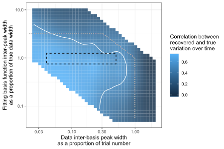
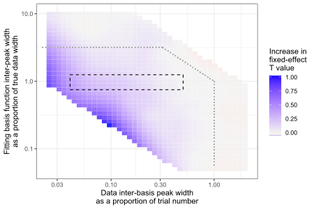
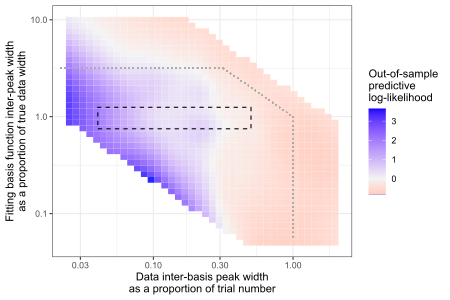

```{r setup, include = FALSE}
knitr::opts_chunk$set(
  collapse = TRUE,
  comment = "#>"
)

```

Changes over time in behavioral measurements, such as drifting attentional selection abilities
due to fluctuations in fatigue from trial to trial, are difficult to identify and to control for.
To address this issue this vignette demonstrates the use and interpretation of by-trial basis functions.
This is a relatively simple method of controlling for unknown fluctuations over time
while also allowing for the recovery of those fluctuations. While there are many other extant methods 
that accomplish similar goals [e.g., @ashwood_mice_2022; @deboeck_using_2009; @zhang_assessing_2019], the method presented here is a good compromise between ease of use, 
flexibility, and power.

Using the `time_basisFun_mem()` function in the `TEfits` package [@cochrane_tefits_2020], models can be specified similarly to`lme4` or `brms`,
with a couple minor additions. The `time_basisFun_mem()` function is really a wrapper for `lme4::lmer`, `lme4::glmer`, 
or `brms::brm`, by augmenting an input mixed-effects model [data and formula] with basis functions over time.

Please don't forget to cite `TEfits` [@cochrane_tefits_2020] if you use this software.

# A Brief Example

As an introductory example, it is possible to fit a dataset with a simple linear mixed-effects model with basis functions over time. Here we will first look at the Approximate Number System training data included in the `TEfits` package [originally from @cochrane_approximate_2019]. We will fit accuracy as predicted by a main effect of the absolute value of stimulus strength (ratio of black dots to white dots), with by-participant intercepts, by-participant slopes, and by-participant basis functions over trial number.

```{r introductory_example, message=FALSE, warning=FALSE}
library(TEfits)
library(lme4)
library(dplyr)
library(tidyr)
library(ggplot2)

m1 <- time_basisFun_mem(acc ~ abs(ratio) + (abs(ratio) | subID)
                        ,data_mem = anstrain
                        ,groupingVarName = 'subID'
                        ,timeVarName = 'trialNum') 
mNULL <- lmer(acc ~ abs(ratio) + (abs(ratio) | subID)
              ,anstrain)
summary(m1)
```

This is not a very good model specification for the data (because the predicted variable is binary, using a generalized model would be better). Still, it can be easily seen that basis functions over trial number are simple to implement. Here they also increase the T value of the fixed-effects predictor (from `r round(summary(mNULL)$coefficients['abs(ratio)','t value'],2)` to `r round(summary(m1)$coefficients['abs(ratio)','t value'],2)`), thereby showing how accounting for variations improves power for fixed effects. This is a common observation, as shown below.

# Simulated Data and Model

The main measurement of time considered here is trial number. By converting the single vector of positive linear 
trial numbers into a set of overlapping basis functions, those basis functions can be included in a mixed-effects
model and can approximate arbitrary fluctuations over time (i.e., as random-effects offsets from the "main" model fits).
The function `TEfits::time_basisFun_df` can be used to construct the basis functions:

```{r construct_bases, fig.height=3, fig.width=6, message=FALSE, warning=FALSE}
basis_df <- time_basisFun_df(1:500, 100)
pivot_longer(basis_df,2:ncol(basis_df)) %>%
  ggplot(aes(x = time_orig, y = value, color = name)) +
  theme_bw() +
  geom_line() +
  labs(x = 'Trial Number',y='Basis function weight',color='Basis function\ntrial center')
```

This process is automated within model fitting using `time_basisFun_mem()`. As an example, we will generate some data and fit a model to it. The data will have fluctuations over time, with no other variable predicting those fluctuations except for trial number. In addition, there will be a "condition-level" binary variable "X" that will be fit with both between-subjects fixed effects and within-subject random effects

```{r generate_data, fig.height=4, fig.width=5}
## generate variations over time
set.seed(9876)

genBasisOffsets <- function(trials,interPeakWidth){
  #
  dTmp <- time_basisFun_df(trials,interPeakWidth)
  dTmp <- dTmp[,2:ncol(dTmp)]
  #
  basisRandomOffsetN <- ceiling(ncol(dTmp) / 3) 
  shuffleCols <- sample(1:ncol(dTmp))
  #
  basisRandomOffset <- rowSums(dTmp[,shuffleCols[1:basisRandomOffsetN]]) -
    rowSums(dTmp[,shuffleCols[(basisRandomOffsetN+1):(2*basisRandomOffsetN)]])
  #
  return(basisRandomOffset)
}

nTrials <- 300
interPeakWidth <- 30
fluctBeta=.5
xVarBeta = .5
nSubjects = 10

dat <- do.call('rbind'
               ,replicate(nSubjects,{
                 subjDat <- data.frame(
                   subID = paste0(sample(letters,5),sample(0:9,5),collapse='')
                   ,trialNum = 1:nTrials
                   ,xVar = sample(c(-.5,.5),nTrials,replace = T)
                 )
                 subjDat$subjBases <- genBasisOffsets(subjDat$trialNum, interPeakWidth + rnorm(1))
                 subjDat$yVar <- rnorm(1,0,.25) + # subject-level intercept
                   rnorm(nTrials) + # "true" noise
                   xVarBeta * rnorm(1,1,.1) * subjDat$xVar + # "X" with random subject-level offset
                   fluctBeta * subjDat$subjBases # Bases over time
                 
                 subjDat  
               },simplify = F)
)
```

First we can look at the structure of the generated data (histograms, scatterplots, and correlations). 
We will look at a single subject's data, though the rest would be very similar:

```{r plot_data}
psych::pairs.panels(dat[1:300,2:5],hist.col='darkred')
```

Here we see that there are fluctuations over time, but upon visual inspection the outcome variable `yVar` is only somewhat correlated with these fluctuations, and any trends over time are not visible due to the random noise in the data.

# Results and Interpretation

First we will fit the model to the data we just generated, then we will look at the summary and recovered timecourse.

```{r fit_example, fig.height=3, fig.width=4}
m2 <- time_basisFun_mem(yVar ~ xVar + (xVar | subID)
                        ,data_mem = dat
                        ,groupingVarName = 'subID'
                        ,timeVarName = 'trialNum'
                        ,basisDens = 30
)

summary(m2)

m2_fitted_timeCourse <- predict(m2,random.only=T
                                ,re.form = as.formula(paste('~',gsub('xVar + (xVar | subID) + ','',as.character(formula(m2))[3],fixed=T)) ) )

plot(dat$trialNum,m2_fitted_timeCourse)
```

The recovered time course appears to be a reasonable approximation of the true change, and indeed, it correlates with the true "unknown" fluctuations at _r_ = `r round(cor(dat$subjBases,m2_fitted_timeCourse),2)`.

# Basis Function Size: Sensitivity and Robustness

The above workflow of data simulation and fitting can be done for many combinations of trial numbers, sizes of true generating basis functions and sizes of basis functions chosen for model fitting. Below are the smoothed results of approximately 1,000 of such simulations; results will be shown for the correlation between true and recovered fluctuations, for change in fixed-effect T value, and for out-of-sample change in log-likelihood (see `?TEfits::time_basisFun_mem`).

## Recovery of trial-to-trial variations



Within the typical regime (heuristically denoted by the grey dashed line) recovery appears to be fairly good, and within the area where the model basis size is similar to the generative basis size (black dashed line) it is quite high.

## Increase in fixed-effect power



Power does not appear to be decreased in any case. In addition, under certain circumstances, the fixed-effect T value can be increased by quite a lot. In the context of these simulations, wherein there is always a true fixed effect in the simulated datasets, this corresponds to an increase in power in most cases.

## Differences in out-of-sample likelihood



Out-of-sample predictive likelihood is often quite good (see `?time_basisFun_mem` for details). However, the improvements in predictive likelihood are not particularly high for model basis function sizes that match the sizes of generative basis functions, thereby indicating that the method of accounting for variation over time is not _selective_ (i.e., choosing the best-fitting basis function size cannot allow the recovery of the true basis function size).

# References

